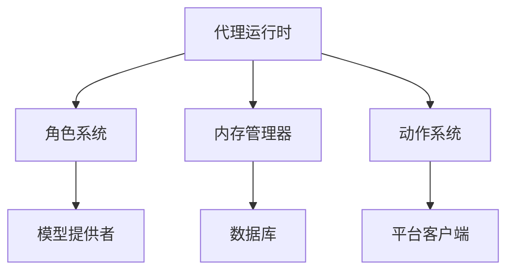

# Eliza 介绍

_如在 [@DegenSpartanAI](https://x.com/degenspartanai) 和 [@MarcAIndreessen](https://x.com/pmairca) 中所见_

## 什么是 Eliza？

Eliza 是一个强大的多代理模拟框架，旨在创建、部署和管理自主 AI 代理。使用 TypeScript 构建，它提供了一个灵活且可扩展的平台，用于开发能够跨多个平台互动的智能代理，同时保持一致的个性和知识。

## 主要特点

### 核心能力

- **多代理架构**：同时部署和管理多个独特的 AI 个性
- **角色系统**：使用 [characterfile](https://github.com/lalalune/characterfile/) 框架创建多样化的代理
- **内存管理**：先进的 RAG（检索增强生成）系统，用于长期记忆和上下文意识
- **平台集成**：与 Discord、Twitter 和其他平台的无缝连接

### 通信与媒体

- **多平台支持**：

    - 全功能的 Discord 集成，支持语音频道
    - Twitter/X 机器人功能
    - Telegram 集成
    - 直接 API 访问

- **媒体处理**：
    - PDF 文档阅读和分析
    - 链接内容提取和总结
    - 音频转录
    - 视频内容处理
    - 图像分析和描述
    - 对话总结

### AI 与技术特点

- **灵活的模型支持**：

    - 使用开源模型进行本地推理
    - 通过 OpenAI 进行云端推理
    - 默认配置 Nous Hermes Llama 3.1B
    - 与 Claude 集成以处理复杂查询

- **技术基础**：
    - 100% TypeScript 实现
    - 模块化架构
    - 可扩展的动作系统
    - 自定义客户端支持
    - 全面的 API

## 使用案例

Eliza 可用于创建：

1. **AI 助手**

    - 客户支持代理
    - 社区管理员
    - 个人助手

2. **社交媒体角色**

    - 自动内容创建者
    - 互动机器人
    - 品牌代表

3. **知识工作者**

    - 研究助手
    - 内容分析师
    - 文档处理器

4. **互动角色**
    - 角色扮演角色
    - 教育导师
    - 娱乐机器人

## 入门

Eliza 设计为易于访问，同时保持强大的功能：

- **快速开始**：使用基本配置和默认角色开始
- **自定义**：通过自定义动作和客户端扩展功能
- **扩展**：部署具有不同个性的多个代理
- **集成**：连接到各种平台和服务

查看我们的 [快速入门指南](./quickstart.md) 开始您的 Eliza 之旅。

## 架构概述

## 社区与支持

Eliza 由活跃的开发者和用户社区支持：

- **开源**：在 [GitHub](https://github.com/elizaos/eliza) 上为项目做出贡献
- **文档**：全面的指南和 API 参考
- **示例**：现成的角色模板和实现
- **支持**：活跃的社区进行故障排除和讨论

## 下一步

- [创建您的第一个代理](../quickstart)
- [了解核心概念](../core/agents)
- [探索高级功能](./guides/advanced.md)

加入我们，与 Eliza 一起构建自主 AI 代理的未来！

---