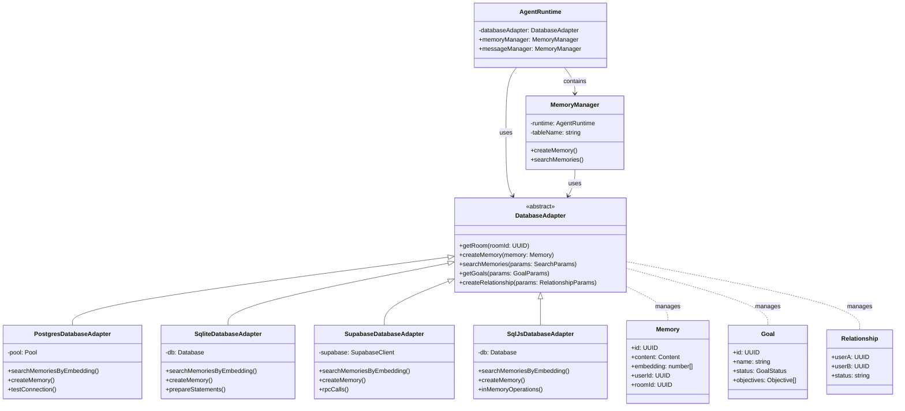

# 🔧 数据库适配器

## 概述

数据库适配器为Eliza提供持久层，通过统一接口实现记忆、关系、目标和其他数据的存储和检索。系统支持多种数据库后端：

### 可用适配器

每个适配器针对不同的使用场景进行了优化：

- **PostgreSQL** (`@elizaos/adapter-postgres`)

    - 生产就绪，支持向量搜索
    - 连接池和高性能
    - 支持JSONB和pgvector

- **SQLite** (`@elizaos/adapter-sqlite`)

    - 轻量级本地开发
    - 无外部依赖
    - 全文搜索功能

- **Supabase** (`@elizaos/adapter-supabase`)

    - 云原生PostgreSQL
    - 实时订阅
    - 内置RPC函数

- **SQL.js** (`@elizaos/adapter-sqljs`)
    - 内存中的SQLite用于测试
    - 浏览器兼容
    - 零配置

### 架构概述

Eliza的数据库适配器为不同存储后端提供统一的数据持久化接口。下图展示了适配器如何与系统集成：



关键组件：

- **DatabaseAdapter**：定义接口的抽象基类
- **具体适配器**：PostgreSQL、SQLite、Supabase和SQL.js实现
- **记忆管理**：与MemoryManager集成进行数据操作
- **数据模型**：记忆、目标和关系数据结构

---

## 安装

```bash
# PostgreSQL
pnpm add @elizaos/adapter-postgres pg

# SQLite
pnpm add @elizaos/adapter-sqlite better-sqlite3

# SQL.js
pnpm add @elizaos/adapter-sqljs sql.js

# Supabase
pnpm add @elizaos/adapter-supabase @supabase/supabase-js
```

---

## 快速开始

### PostgreSQL 设置

```typescript
import { PostgresDatabaseAdapter } from "@elizaos/adapter-postgres";

const db = new PostgresDatabaseAdapter({
    connectionString: process.env.DATABASE_URL,
    max: 20, // 连接池大小
    idleTimeoutMillis: 30000,
    connectionTimeoutMillis: 2000,
});

// 测试连接
await db.testConnection();
```

### SQLite 设置

```typescript
import { SqliteDatabaseAdapter } from "@elizaos/adapter-sqlite";
import Database from "better-sqlite3";

const db = new SqliteDatabaseAdapter(
    new Database("./db.sqlite", {
        // SQLite 选项
        memory: false,
        readonly: false,
        fileMustExist: false,
    }),
);
```

### Supabase 设置

```typescript
import { SupabaseDatabaseAdapter } from "@elizaos/adapter-supabase";

const db = new SupabaseDatabaseAdapter(
    process.env.SUPABASE_URL!,
    process.env.SUPABASE_ANON_KEY!,
);
```

---

## 核心功能

### 记忆操作

```typescript
// 创建记忆
await db.createMemory({
    id: uuid(),
    type: "messages",
    content: {
        text: "Hello world",
        attachments: [],
    },
    embedding: new Float32Array(1536), // 嵌入向量
    userId,
    roomId,
    agentId,
    createdAt: Date.now(),
    unique: true,
});

// 按嵌入搜索
const memories = await db.searchMemories({
    tableName: "messages",
    roomId,
    embedding: vectorData,
    match_threshold: 0.8,
    match_count: 10,
    unique: true,
});

// 获取最近的记忆
const recent = await db.getMemories({
    roomId,
    count: 10,
    unique: true,
    tableName: "messages",
    start: startTime,
    end: endTime,
});
```

### 关系管理

```typescript
// 创建关系
await db.createRelationship({
    userA: user1Id,
    userB: user2Id,
});

// 获取关系
const relationship = await db.getRelationship({
    userA: user1Id,
    userB: user2Id,
});

// 获取所有关系
const relationships = await db.getRelationships({
    userId: user1Id,
});
```

### 目标管理

```typescript
// 创建目标
await db.createGoal({
    id: uuid(),
    roomId,
    userId,
    name: "Complete task",
    status: GoalStatus.IN_PROGRESS,
    objectives: [
        { text: "Step 1", completed: false },
        { text: "Step 2", completed: false },
    ],
});

// 更新目标状态
await db.updateGoalStatus({
    goalId,
    status: GoalStatus.COMPLETED,
});

// 获取活动目标
const goals = await db.getGoals({
    roomId,
    userId,
    onlyInProgress: true,
    count: 10,
});
```

### 房间与参与者管理

```typescript
// 创建房间
const roomId = await db.createRoom();

// 添加参与者
await db.addParticipant(userId, roomId);

// 获取参与者
const participants = await db.getParticipantsForRoom(roomId);

// 获取参与者的房间
const rooms = await db.getRoomsForParticipant(userId);
```

---

## 向量搜索实现

### PostgreSQL（使用pgvector）

```typescript
// PostgreSQL 向量搜索
async searchMemoriesByEmbedding(
  embedding: number[],
  params: {
    match_threshold?: number;
    count?: number;
    roomId?: UUID;
    unique?: boolean;
    tableName: string;
  }
): Promise<Memory[]> {
  const client = await this.pool.connect();
  try {
    let sql = `
      SELECT *,
      1 - (embedding <-> $1::vector) as similarity
      FROM memories
      WHERE type = $2
    `;

    const values: any[] = [
      `[${embedding.join(",")}]`,
      params.tableName
    ];

    if (params.unique) {
      sql += ` AND "unique" = true`;
    }

    if (params.roomId) {
      sql += ` AND "roomId" = $3::uuid`;
      values.push(params.roomId);
    }

    if (params.match_threshold) {
      sql += ` AND 1 - (embedding <-> $1::vector) >= $4`;
      values.push(params.match_threshold);
    }

    sql += ` ORDER BY embedding <-> $1::vector`;

    if (params.count) {
      sql += ` LIMIT $5`;
      values.push(params.count);
    }

    const { rows } = await client.query(sql, values);
    return rows.map(row => ({
      ...row,
      content: typeof row.content === "string"
        ? JSON.parse(row.content)
        : row.content,
      similarity: row.similarity
    }));
  } finally {
    client.release();
  }
}
```

### SQLite（使用sqlite-vss）

```typescript
// SQLite 向量搜索实现
async searchMemories(params: {
  tableName: string;
  roomId: UUID;
  embedding: number[];
  match_threshold: number;
  match_count: number;
  unique: boolean;
}): Promise<Memory[]> {
  const queryParams = [
    new Float32Array(params.embedding),
    params.tableName,
    params.roomId,
    params.match_count
  ];

  let sql = `
    SELECT *, vec_distance_L2(embedding, ?) AS similarity
    FROM memories
    WHERE type = ?
  `;

  if (params.unique) {
    sql += " AND `unique` = 1";
  }

  sql += ` ORDER BY similarity ASC LIMIT ?`;

  const memories = this.db.prepare(sql).all(...queryParams);

  return memories.map(memory => ({
    ...memory,
    content: JSON.parse(memory.content),
    similarity: memory.similarity
  }));
}
```

---

## 模式管理

### PostgreSQL 模式

```sql
CREATE EXTENSION IF NOT EXISTS vector;

CREATE TABLE IF NOT EXISTS accounts (
    id UUID PRIMARY KEY,
    "createdAt" DEFAULT CURRENT_TIMESTAMP,
    "name" TEXT,
    "username" TEXT,
    "email" TEXT NOT NULL,
    "avatarUrl" TEXT,
    "details" JSONB DEFAULT '{}'::"jsonb",
    "is_agent" BOOLEAN DEFAULT false NOT NULL,
    "location" TEXT,
    "profile_line" TEXT,
    "signed_tos" BOOLEAN DEFAULT false NOT NULL
);

ALTER TABLE ONLY accounts ADD CONSTRAINT users_email_key UNIQUE (email);

CREATE TABLE IF NOT EXISTS participants (
    "id" UUID PRIMARY KEY,
    "createdAt" TIMESTAMPTZ DEFAULT CURRENT_TIMESTAMP NOT NULL,
    "userId" UUID REFERENCES accounts(id),
    "roomId" UUID REFERENCES rooms(id),
    "userState" TEXT,  -- For MUTED, NULL, or FOLLOWED states
    "last_message_read" UUID
);

ALTER TABLE ONLY participants ADD CONSTRAINT participants_id_key UNIQUE (id);
ALTER TABLE ONLY participants ADD CONSTRAINT participants_roomId_fkey FOREIGN KEY ("roomId") REFERENCES rooms(id);
ALTER TABLE ONLY participants ADD CONSTRAINT participants_userId_fkey FOREIGN KEY ("userId") REFERENCES accounts(id);

CREATE TABLE rooms (
  id UUID PRIMARY KEY,
  "createdAt" TIMESTAMP DEFAULT CURRENT_TIMESTAMP
);

CREATE TABLE memories (
  id UUID PRIMARY KEY,
  type TEXT NOT NULL,
  content JSONB NOT NULL,
  embedding vector(1536),
  "userId" UUID NOT NULL,
  "roomId" UUID NOT NULL,
  "agentId" UUID NOT NULL,
  "unique" BOOLEAN DEFAULT FALSE,
  "createdAt" TIMESTAMP NOT NULL
);

ALTER TABLE ONLY memories ADD CONSTRAINT memories_roomId_fkey FOREIGN KEY ("roomId") REFERENCES rooms(id);
ALTER TABLE ONLY memories ADD CONSTRAINT memories_userId_fkey FOREIGN KEY ("userId") REFERENCES accounts(id);

CREATE INDEX memory_embedding_idx ON
  memories USING ivfflat (embedding vector_cosine_ops)
  WITH (lists = 100);

CREATE TABLE relationships (
  id UUID PRIMARY KEY,
  "userA" UUID NOT NULL,
  "userB" UUID NOT NULL,
  status TEXT DEFAULT 'ACTIVE',
  "createdAt" TIMESTAMP DEFAULT CURRENT_TIMESTAMP
);

ALTER TABLE ONLY relationships ADD CONSTRAINT friendships_id_key UNIQUE (id);
ALTER TABLE ONLY relationships ADD CONSTRAINT relationships_userA_fkey FOREIGN KEY ("userA") REFERENCES accounts(id);
ALTER TABLE ONLY relationships ADD CONSTRAINT relationships_userB_fkey FOREIGN KEY ("userB") REFERENCES accounts(id);
ALTER TABLE ONLY relationships ADD CONSTRAINT relationships_userId_fkey FOREIGN KEY ("userId") REFERENCES accounts(id);

CREATE TABLE goals (
  id UUID PRIMARY KEY,
  "roomId" UUID NOT NULL,
  "userId" UUID,
  name TEXT NOT NULL,
  status TEXT NOT NULL,
  objectives JSONB NOT NULL,
  "createdAt" TIMESTAMP DEFAULT CURRENT_TIMESTAMP
);
```

### SQLite 模式

```typescript
const sqliteTables = `
CREATE TABLE IF NOT EXISTS memories (
  id TEXT PRIMARY KEY,
  type TEXT NOT NULL,
  content TEXT NOT NULL,
  embedding BLOB,
  userId TEXT NOT NULL,
  roomId TEXT NOT NULL,
  agentId TEXT NOT NULL,
  "unique" INTEGER DEFAULT 0,
  createdAt INTEGER NOT NULL
);

CREATE VIRTUAL TABLE IF NOT EXISTS memory_fts
  USING fts5(content, content_rowid=id);

CREATE TABLE IF NOT EXISTS goals (
  id TEXT PRIMARY KEY,
  roomId TEXT NOT NULL,
  userId TEXT,
  name TEXT NOT NULL,
  status TEXT NOT NULL,
  objectives TEXT NOT NULL,
  createdAt INTEGER DEFAULT (unixepoch())
);
`;
```

---

## 性能优化

### 连接池

```typescript
// PostgreSQL 连接池
constructor(connectionConfig: any) {
  super();
  this.pool = new Pool({
    ...connectionConfig,
    max: 20,
    idleTimeoutMillis: 30000,
    connectionTimeoutMillis: 2000
  });

  this.pool.on("error", (err) => {
    console.error("Unexpected error on idle client", err);
  });
}
```

### 预处理语句

```typescript
// SQLite 预处理语句
class SqliteDatabaseAdapter extends DatabaseAdapter {
    private statements = new Map<string, Statement>();

    prepareStatement(sql: string): Statement {
        let stmt = this.statements.get(sql);
        if (!stmt) {
            stmt = this.db.prepare(sql);
            this.statements.set(sql, stmt);
        }
        return stmt;
    }

    // 使用预处理语句
    async getMemoryById(id: UUID): Promise<Memory | null> {
        const stmt = this.prepareStatement(
            "SELECT * FROM memories WHERE id = ?",
        );
        const memory = stmt.get(id);
        return memory
            ? {
                  ...memory,
                  content: JSON.parse(memory.content),
              }
            : null;
    }
}
```

### 批量操作

```typescript
// 批量创建记忆
async createMemories(memories: Memory[], tableName: string) {
  const client = await this.pool.connect();
  try {
    await client.query('BEGIN');

    const stmt = await client.prepare(
      `INSERT INTO memories (
        id, type, content, embedding, "userId",
        "roomId", "agentId", "unique", "createdAt"
      ) VALUES ($1, $2, $3, $4, $5, $6, $7, $8, $9)`
    );

    for (const memory of memories) {
      await stmt.execute([
        memory.id,
        tableName,
        JSON.stringify(memory.content),
        memory.embedding,
        memory.userId,
        memory.roomId,
        memory.agentId,
        memory.unique ?? false,
        memory.createdAt
      ]);
    }

    await client.query('COMMIT');
  } catch (error) {
    await client.query('ROLLBACK');
    throw error;
  } finally {
    client.release();
  }
}
```

---

## 错误处理

```typescript
class DatabaseAdapter {
    protected async withTransaction<T>(
        callback: (client: PoolClient) => Promise<T>,
    ): Promise<T> {
        const client = await this.pool.connect();
        try {
            await client.query("BEGIN");
            const result = await callback(client);
            await client.query("COMMIT");
            return result;
        } catch (error) {
            await client.query("ROLLBACK");
            if (error instanceof DatabaseError) {
                // 处理特定数据库错误
                if (error.code === "23505") {
                    throw new UniqueViolationError(error);
                }
            }
            throw error;
        } finally {
            client.release();
        }
    }
}
```

## 扩展点

### 自定义适配器实现

```typescript
class CustomDatabaseAdapter extends DatabaseAdapter {
    constructor(config: CustomConfig) {
        super();
        // 初始化自定义数据库连接
    }

    // 实现所需方法
    async createMemory(memory: Memory, tableName: string): Promise<void> {
        // 自定义实现
    }

    async searchMemories(params: SearchParams): Promise<Memory[]> {
        // 自定义实现
    }

    // 添加自定义功能
    async customOperation(): Promise<void> {
        // 自定义数据库操作
    }
}
```

---

## 最佳实践

1. **连接管理**

    - 对PostgreSQL使用连接池
    - 优雅处理连接失败
    - 实现适当的清理

2. **事务处理**

    - 对原子操作使用事务
    - 实现适当的回滚处理
    - 管理嵌套事务

3. **错误处理**

    - 实现特定错误类型
    - 处理约束违规
    - 提供有意义的错误信息

4. **资源管理**
    - 正确关闭连接
    - 清理预处理语句
    - 监控连接池

## 相关资源

- [数据库模式参考](/api)
- [错误处理](../../packages/core)

---