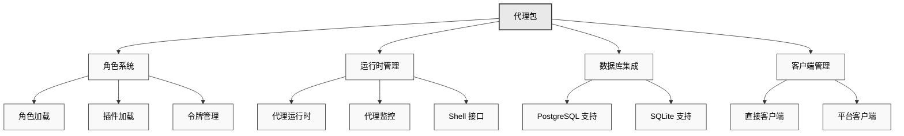

# 🤖 代理包

代理包 (`@eliza/agent`) 提供了 Eliza 的高级编排层，管理代理生命周期、角色加载、客户端初始化和运行时协调。

## 架构概述



## 主要职责

代理包 (`@elizaos/agent`) 作为 Eliza 的编排层，负责：

- 角色和插件加载
- 运行时初始化和管理
- 数据库适配器选择
- 客户端初始化和协调
- 令牌和环境管理

## 安装

```bash
pnpm add @elizaos/agent
```

## 快速开始

```typescript
import { startAgents, loadCharacters } from "@elizaos/agent";

// 从文件加载角色
const args = parseArguments();
const characters = await loadCharacters(args.characters || args.character);

// 启动代理系统
await startAgents();
```

## 核心功能

### 角色加载

```typescript
export async function loadCharacters(
    charactersArg: string,
): Promise<Character[]> {
    const characterPaths = normalizeCharacterPaths(charactersArg);
    const loadedCharacters = [];

    for (const path of characterPaths) {
        try {
            const character = JSON.parse(fs.readFileSync(path, "utf8"));

            // 如果指定了插件，则加载插件
            if (character.plugins) {
                character.plugins = await Promise.all(
                    character.plugins.map(async (plugin) => {
                        const importedPlugin = await import(plugin);
                        return importedPlugin;
                    }),
                );
            }

            loadedCharacters.push(character);
        } catch (error) {
            console.error(`从 ${path} 加载角色时出错: ${error}`);
        }
    }

    // 如果没有加载任何角色，则回退到默认角色
    return loadedCharacters.length > 0 ? loadedCharacters : [defaultCharacter];
}
```

### 代理创建

```typescript
export async function createAgent(
    character: Character,
    db: IDatabaseAdapter,
    token: string,
) {
    return new AgentRuntime({
        databaseAdapter: db,
        token,
        modelProvider: character.modelProvider,
        character,
        plugins: [
            bootstrapPlugin,
            nodePlugin,
            character.settings.secrets.WALLET_PUBLIC_KEY ? solanaPlugin : null,
        ].filter(Boolean),
        providers: [],
        actions: [],
        services: [],
        managers: [],
    });
}
```

### 客户端初始化

```typescript
export async function initializeClients(
    character: Character,
    runtime: IAgentRuntime,
) {
    const clients = [];
    const clientTypes =
        character.clients?.map((str) => str.toLowerCase()) || [];

    if (clientTypes.includes(Clients.DISCORD)) {
        clients.push(await DiscordClientInterface.start(runtime));
    }
    if (clientTypes.includes(Clients.TELEGRAM)) {
        clients.push(await TelegramClientInterface.start(runtime));
    }
    if (clientTypes.includes(Clients.TWITTER)) {
        clients.push(await TwitterClientInterface.start(runtime));
    }
    if (clientTypes.includes(Clients.DIRECT)) {
        clients.push(await AutoClientInterface.start(runtime));
    }

    return clients;
}
```

## 最佳实践

### 令牌管理

令牌可以通过两种方式配置：

1. 使用命名空间环境变量：
```env
CHARACTER.YOUR_CHARACTER_NAME.OPENAI_API_KEY=sk-...
CHARACTER.YOUR_CHARACTER_NAME.ANTHROPIC_API_KEY=sk-...
```

2. 使用角色设置：
```typescript
export function getTokenForProvider(
    provider: ModelProviderName,
    character: Character,
) {
    switch (provider) {
        case ModelProviderName.OPENAI:
            return (
                character.settings?.secrets?.OPENAI_API_KEY ||
                settings.OPENAI_API_KEY
            );
        case ModelProviderName.ANTHROPIC:
            return (
                character.settings?.secrets?.ANTHROPIC_API_KEY ||
                settings.ANTHROPIC_API_KEY
            );
        // 处理其他提供者...
    }
}
```

系统将按以下顺序检查令牌：
1. 角色特定的命名空间环境变量
2. 来自 JSON 的角色设置
3. 全局环境变量

### 数据库选择

```typescript
function initializeDatabase() {
    if (process.env.POSTGRES_URL) {
        return new PostgresDatabaseAdapter({
            connectionString: process.env.POSTGRES_URL,
        });
    }
    return new SqliteDatabaseAdapter(new Database("./db.sqlite"));
}
```

## 常见问题及解决方案

1. **角色加载**

```typescript
// 处理缺少角色文件的情况
if (!characters || characters.length === 0) {
    console.log("未找到角色，使用默认角色");
    characters = [defaultCharacter];
}
```

2. **插件加载**

```typescript
// 处理插件导入错误
try {
    character.plugins = await Promise.all(
        character.plugins.map((plugin) => import(plugin)),
    );
} catch (error) {
    console.error(`加载插件时出错: ${error.message}`);
    character.plugins = [];
}
```

## 相关资源

- [插件系统](../../packages/plugins)

---

