# 🔌 客户端包

## 概述

Eliza 的客户端包支持与各种平台和服务的集成。每个客户端提供标准化接口，用于发送和接收消息、处理媒体以及与平台特定功能交互。

### 架构概述

```mermaid
graph TD
    RT["代理运行时"]
    CI["客户端接口"]
    RT --> CI

    %% 主要客户端
    CI --> DC["直接客户端"]
    CI --> DSC["Discord 客户端"]
    CI --> TC["Telegram 客户端"]
    CI --> TWC["Twitter 客户端"]
    CI --> AC["自动客户端"]

    %% 关键功能 - 每个客户端一个
    DC --> |"REST API"| DC1["消息和图片"]
    DSC --> |"机器人集成"| DSC1["语音和消息"]
    TC --> |"机器人 API"| TC1["命令和媒体"]
    TWC --> |"社交"| TWC1["帖子和互动"]
    AC --> |"交易"| AC1["分析和执行"]

    %% 简单的样式，具有更好的对比度和黑色文本
    classDef default fill:#f9f9f9,stroke:#333,stroke-width:1px,color:black
    classDef highlight fill:#e9e9e9,stroke:#333,stroke-width:2px,color:black

    class RT,CI highlight
```



## 可用客户端

- **Discord** (`@eliza/client-discord`) - 完整的 Discord 机器人集成
- **Twitter** (`@eliza/client-twitter`) - Twitter 机器人和互动处理
- **Telegram** (`@eliza/client-telegram`) - Telegram 机器人集成
- **Direct** (`@eliza/client-direct`) - 自定义集成的直接 API 接口
- **Auto** (`@eliza/client-auto`) - 自动交易和互动客户端

---

## 安装

```bash
# Discord
pnpm add @eliza/client-discord

# Twitter
pnpm add @eliza/client-twitter

# Telegram
pnpm add @eliza/client-telegram

# Direct API
pnpm add @eliza/client-direct

# Auto Client
pnpm add @eliza/client-auto
```

---

## Discord 客户端

Discord 客户端提供与 Discord 功能的完整集成，包括语音、反应和附件。

### 基本设置

```typescript
import { DiscordClientInterface } from "@eliza/client-discord";

// 初始化客户端
const client = await DiscordClientInterface.start(runtime);

// 在 .env 中配置
DISCORD_APPLICATION_ID = your_app_id;
DISCORD_API_TOKEN = your_bot_token;
```

### 功能

- 语音频道集成
- 消息附件
- 反应处理
- 媒体转录
- 房间管理

### 语音集成

```typescript
class VoiceManager {
  // 加入语音频道
  async handleJoinChannelCommand(interaction) {
    await this.joinVoiceChannel(channel);
  }

  // 处理语音状态更新
  async handleVoiceStateUpdate(oldState, newState) {
    if (newState.channelId) {
      await this.handleUserJoinedChannel(newState);
    }
  }
}
```

### 消息处理

```typescript
class MessageManager {
  async handleMessage(message) {
    // 忽略机器人消息
    if (message.author.bot) return;

    // 处理附件
    if (message.attachments.size > 0) {
      await this.processAttachments(message);
    }

    // 生成响应
    await this.generateResponse(message);
  }
}
```

## Twitter 客户端

Twitter 客户端支持发布、搜索和与 Twitter 用户互动。

### 基本设置

```typescript
import { TwitterClientInterface } from "@eliza/client-twitter";
// 初始化客户端
const client = await TwitterClientInterface.start(runtime);

// 在 .env 中配置
TWITTER_USERNAME = your_username;
TWITTER_PASSWORD = your_password;
TWITTER_EMAIL = your_email;
```

### 组件

- **PostClient**: 处理创建和管理帖子
- **SearchClient**: 处理搜索功能
- **InteractionClient**: 管理用户互动

### 帖子管理

```typescript
class TwitterPostClient {
  async createPost(content: string) {
    return await this.post({
      text: content,
      media: await this.processMedia(),
    });
  }

  async replyTo(tweetId: string, content: string) {
    return await this.post({
      text: content,
      reply: { in_reply_to_tweet_id: tweetId },
    });
  }
}
```

### 搜索功能

```typescript
class TwitterSearchClient {
  async searchTweets(query: string) {
    return await this.search({
      query,
      filters: {
        recency: "recent",
        language: "en",
      },
    });
  }
}
```

## Telegram 客户端

Telegram 客户端提供消息和机器人功能。

### 基本设置

```typescript
import { TelegramClientInterface } from "@eliza/client-telegram";

// 初始化客户端
const client = await TelegramClientInterface.start(runtime);

// 在 .env 中配置
TELEGRAM_BOT_TOKEN = your_bot_token;
```

### 消息管理

```typescript
class TelegramClient {
  async handleMessage(message) {
    // 处理消息内容
    const content = await this.processMessage(message);

    // 生成响应
    const response = await this.generateResponse(content);

    // 发送响应
    await this.sendMessage(message.chat.id, response);
  }
}
```

## Direct 客户端

Direct 客户端提供自定义集成的 REST API 接口。

### 基本设置

```typescript
import { DirectClientInterface } from "@eliza/client-direct";

// 初始化客户端
const client = await DirectClientInterface.start(runtime);
```

### API 端点

```typescript
class DirectClient {
  constructor() {
    // 消息端点
    this.app.post("/:agentId/message", async (req, res) => {
      const response = await this.handleMessage(req.body);
      res.json(response);
    });

    // 图片生成端点
    this.app.post("/:agentId/image", async (req, res) => {
      const images = await this.generateImage(req.body);
      res.json(images);
    });
  }
}
```

## Auto 客户端

Auto 客户端支持自动互动和交易。

### 基本设置

```typescript
import { AutoClientInterface } from "@eliza/client-auto";

// 初始化客户端
const client = await AutoClientInterface.start(runtime);
```

### 自动交易

```typescript
class AutoClient {
  constructor(runtime: IAgentRuntime) {
    this.runtime = runtime;

    // 启动交易循环
    this.interval = setInterval(
      () => {
        this.makeTrades();
      },
      60 * 60 * 1000,
    ); // 1 小时间隔
  }

  async makeTrades() {
    // 获取推荐
    const recommendations = await this.getHighTrustRecommendations();

    // 分析代币
    const analysis = await this.analyzeTokens(recommendations);

    // 执行交易
    await this.executeTrades(analysis);
  }
}
```

## 通用功能

### 消息处理

所有客户端实现标准消息处理：

```typescript
interface ClientInterface {
  async handleMessage(message: Message): Promise<void>;
  async generateResponse(context: Context): Promise<Response>;
  async sendMessage(destination: string, content: Content): Promise<void>;
}
```

### 媒体处理

```typescript
interface MediaProcessor {
  async processImage(image: Image): Promise<ProcessedImage>;
  async processVideo(video: Video): Promise<ProcessedVideo>;
  async processAudio(audio: Audio): Promise<ProcessedAudio>;
}
```

### 错误处理

```typescript
class BaseClient {
  protected async handleError(error: Error) {
    console.error("客户端错误:", error);

    if (error.code === "RATE_LIMIT") {
      await this.handleRateLimit(error);
    } else if (error.code === "AUTH_FAILED") {
      await this.refreshAuth();
    }
  }
}
```

---

## 最佳实践

1. **认证**

   - 将凭据安全地存储在环境变量中
   - 实现令牌刷新机制
   - 优雅地处理认证错误

2. **速率限制**

   - 实现指数退避
   - 跟踪 API 使用情况
   - 在速率限制期间排队消息

3. **错误处理**

   - 记录带有上下文的错误
   - 实现重试逻辑
   - 处理平台特定错误

4. **媒体处理**
   - 在处理前验证媒体
   - 处理不同的文件格式
   - 实现大小限制

### 错误处理

```typescript
class BaseClient {
  protected async handleError(error: Error) {
    if (error.code === "RATE_LIMIT") {
      await this.handleRateLimit(error);
    } else if (error.code === "AUTH_FAILED") {
      await this.refreshAuth();
    } else if (error.code === "NETWORK_ERROR") {
      await this.reconnect();
    }

    // 记录错误
    console.error("客户端错误:", {
      type: error.name,
      message: error.message,
      code: error.code,
      stack: error.stack,
    });
  }
}
```

### 资源管理

```typescript
class ClientManager {
  private async cleanup() {
    // 关闭连接
    await Promise.all(this.connections.map((conn) => conn.close()));

    // 清除缓存
    this.cache.clear();

    // 取消计时器
    this.timers.forEach((timer) => clearInterval(timer));
  }

  private async reconnect() {
    await this.cleanup();
    await wait(this.calculateBackoff());
    await this.initialize();
  }
}
```

### 速率限制

```typescript
class RateLimiter {
  private async handleRateLimit(error: RateLimitError) {
    const delay = this.calculateBackoff(error);
    await wait(delay);
    return this.retryRequest();
  }

  private calculateBackoff(error: RateLimitError): number {
    return Math.min(this.baseDelay * Math.pow(2, this.attempts), this.maxDelay);
  }
}
```

---

## 性能优化

### 连接管理

```typescript
class ClientManager {
  private reconnect() {
    await this.disconnect();
    await wait(this.backoff());
    await this.connect();
  }
}
```

### 消息排队

```typescript
class MessageQueue {
  async queueMessage(message: Message) {
    await this.queue.push(message);
    this.processQueue();
  }
}
```

## 故障排除

### 常见问题

1. **认证失败**

```typescript
// 实现令牌刷新
async refreshAuth() {
  const newToken = await this.requestNewToken();
  await this.updateToken(newToken);
}
```

2. **速率限制**

```typescript
// 处理速率限制
async handleRateLimit(error) {
  const delay = this.calculateBackoff(error);
  await wait(delay);
  return this.retryRequest();
}
```

3. **连接问题**

```typescript
// 实现重新连接逻辑
async handleDisconnect() {
  await this.reconnect({
    maxAttempts: 5,
    backoff: 'exponential'
  });
}
```

4. **消息处理失败**

```typescript
async processMessage(message) {
  try {
    return await this.messageProcessor(message);
  } catch (error) {
    if (error.code === "INVALID_FORMAT") {
      return this.handleInvalidFormat(message);
    }
    throw error;
  }
}
```

## 相关资源

- [错误处理](../../packages/core)

---