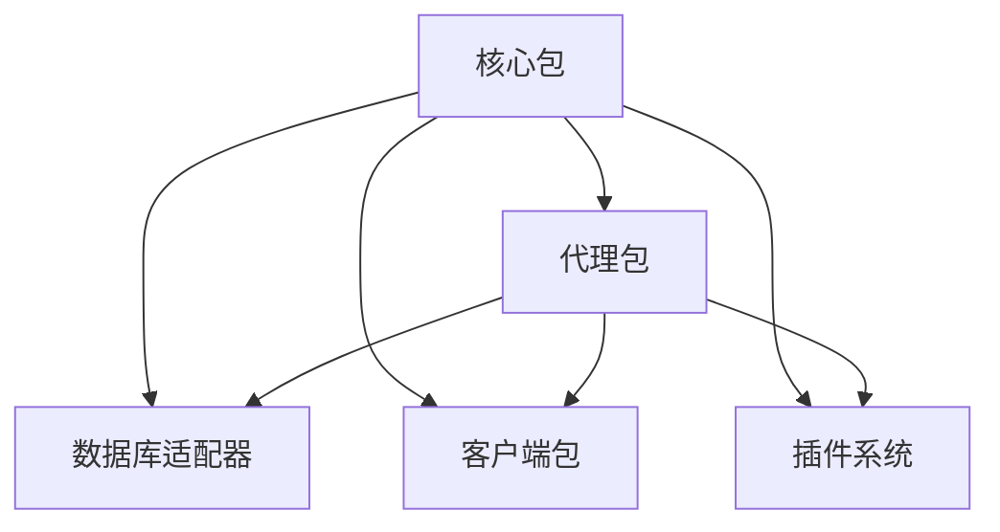

# 📖 套件概述

## 核心组件

- **@elizaos/core**: 中央框架和共享功能
- **@elizaos/agent**: 代理运行时和管理
- **@elizaos/adapters**: 数据库实现（PostgreSQL、SQLite等）
- **@elizaos/clients**: 平台集成（Discord、Telegram等）
- **@elizaos/plugins**: 扩展模块以增加功能

## 套件架构

Eliza 框架基于模块化架构构建，每个包都有特定的用途：

1. **核心包**：提供基本构建模块
2. **代理包**：处理代理生命周期和运行时
3. **适配器**：支持不同的存储后端
4. **客户端**：连接到各种平台
5. **插件**：添加专门的功能

## 套件依赖关系



## 入门指南

```
# 安装核心包
pnpm add @elizaos/core

# 安装特定适配器
pnpm add @elizaos/adapter-postgres
pnpm add @elizaos/adapter-sqlite

# 安装客户端
pnpm add @elizaos/client-discord
pnpm add @elizaos/client-Telegram
```